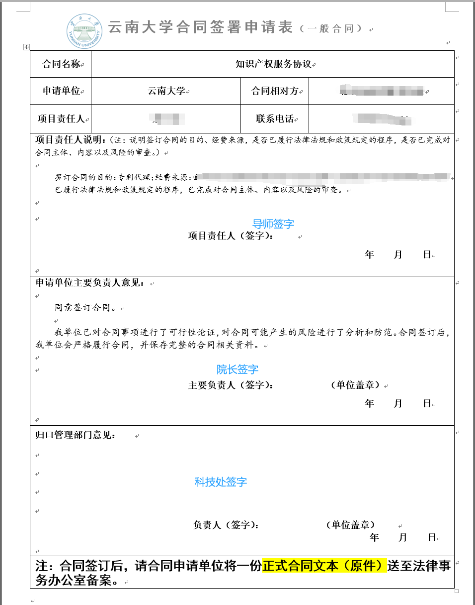
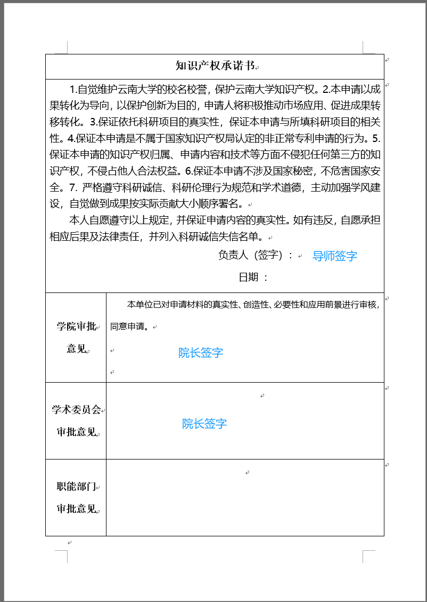
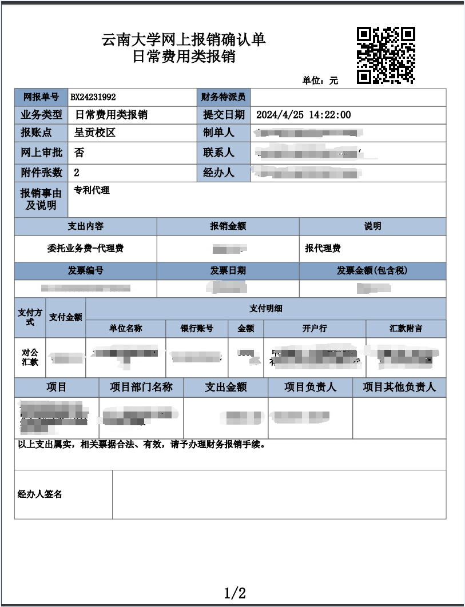

[toc]

# step1: 专利交底书

将你的项目内容写出来，交给代理律师，他们检索该项目是否能够申请专利

# step2: 合同+我们这边的手续

- 代理律所将`知识产权服务协议`快递过来, 我们拿到`知识产权服务协议`, 合同导师签字
- 填写`云南大学合同签署申请表（一般合同）`, 具体下载地址自行查找, 示例:
  
- 填写`云南大学知识产权申请审批表`, 去[这里](http://www.sto.ynu.edu.cn/xzzq1/cgzljhxxm.htm)下载, 示例:
  
- 填写完成，导师签字，院长签字
- 去科技处, 签字(即上述两张表最后的签字, 记得带上合同); 科技处签完字后(云南大学合同签署申请表（一般合同）会返回, 盖合同章的时候会收走; 审批表不会返回), 合同还需要盖章, 区楼上法务处盖合同上的章!

# step3: 报销流程

- 找对方律师开取发票
- 导师填写系统，生成`报销单`, 学院盖章
  
- 将发票, 报销单, 合同交到财务处即可
