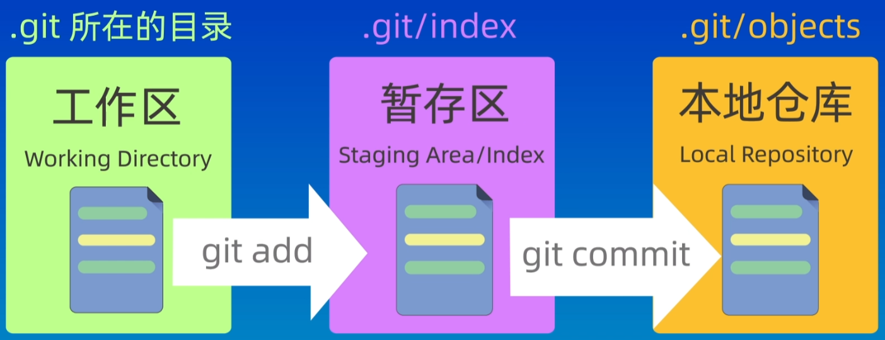
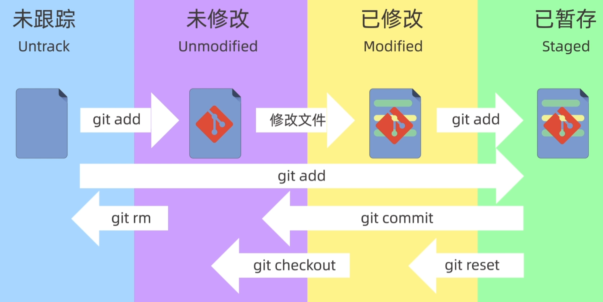
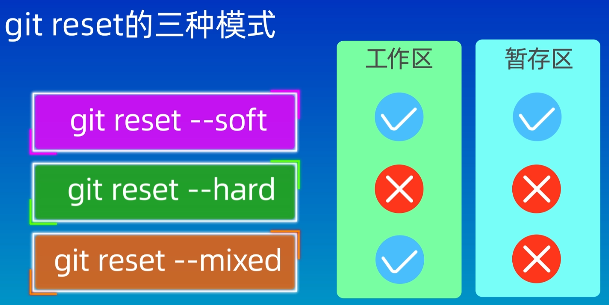
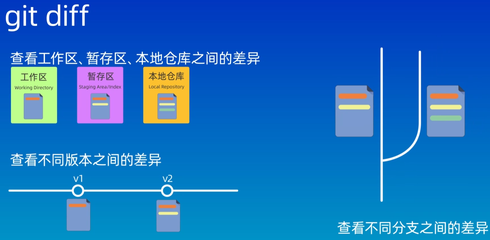
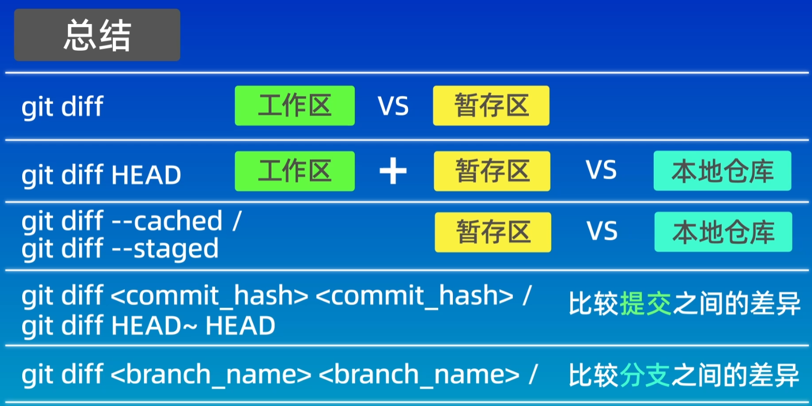
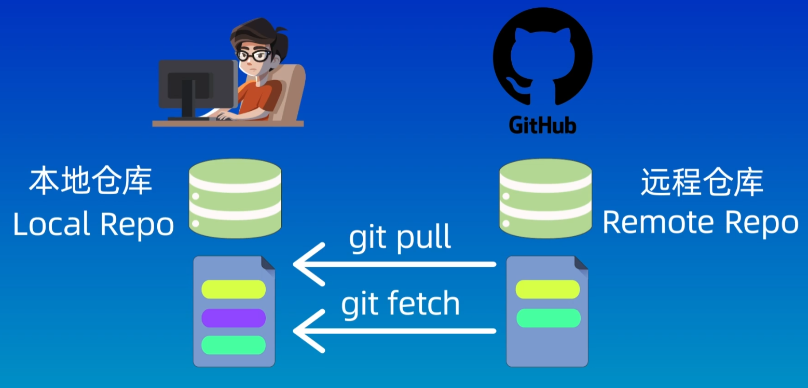
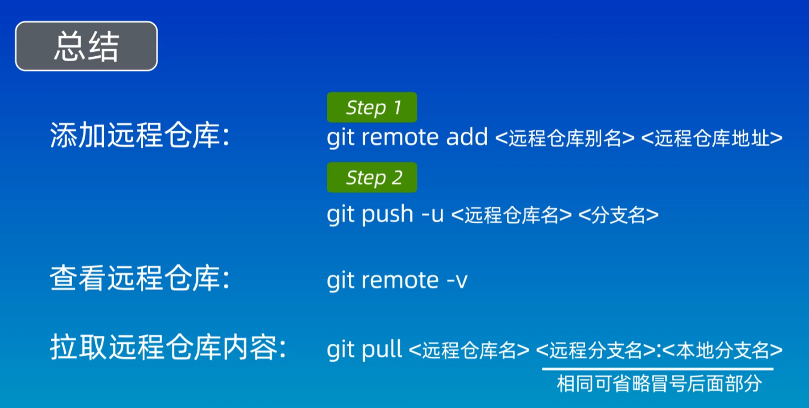
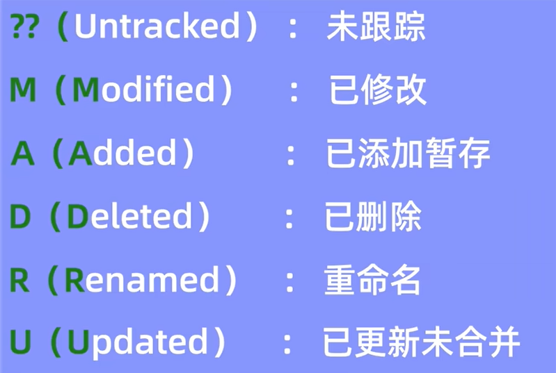
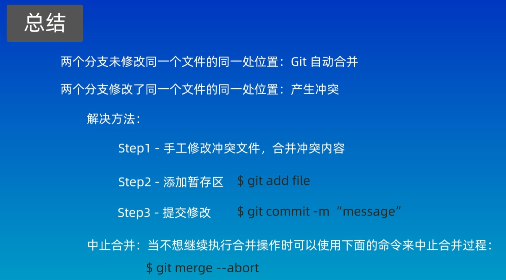
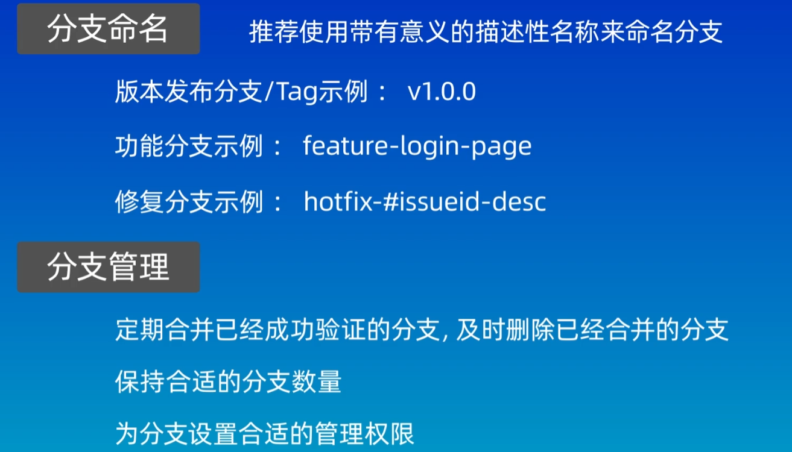

# 1. config
`省略(local)`: 本地配置, 只对本地仓库有效

`--global`: 全局配置, 所有仓库有效

`--system`: 系统配置, 对所有用户有效(一般不会使用)

`git config --global credential.helper store`: 保存身份验证信息

# 2. 创建仓库
## 方式一:
`git init`: 在机器本地创建一个可以被git管理的仓库

一般情况下, 还需要设定 `--set-upstream` 参数, 应该是指定主分支的意思; 使用命令: `git push --set-upstream origin <分支名>`

`git push --set-upstream-to <>`: 这个不知道干啥的

## 方式二:
`git clone`: 从远程服务器上克隆一个已经存在的仓库

# 3. 工作区和文件状态
## a. 工作区(working directory): `.git` 所在的目录
就是文件夹
## b. 暂存区(staging area/index): `.git/index`
是一种临时存储区域, 用于保存即将提交到git仓库的修改内容
## c. 本地仓库(local repository): `.git/objects`
通过 `git init` 命令创建的仓库, 包含完整的项目历史和元数据, git 存储代码和版本信息的主要位置

三者关系如下:


## git 文件存在的状态
- 未跟踪(Untrack)
- 未修改(Unmodified)
- 已修改(Modified)
- 已暂存(Staged)



# 4. 添加和提交文件
先看几条命令
- `git init`: 创建仓库
- `git status`: 查看仓库的状态
- `git add`: 添加到暂存区
  - `git restore --staged <file>...`: 取消暂存
- `git commit`: 提交到本地仓库(只会提交暂存区中的文件, 不会提交工作区的文件; 所以在`git commit`之前, 需要`git add`)
  - `-m`: 指定提交的信息(例如: `git commit -m "new commit"`); 不使用 `-m`, 会进入一个交互页面, 默认 vim 编辑
  - `-a`: 一个命令完成添加暂存和提交两个动作, 也就是不需要使用 `git add . ` 命令.

- `git log`: 查看提交日志
```bash
commit df2d062474bf1e9e1edbca5c4540eb54863e6ccc (HEAD -> main, origin/main, origin/HEAD)
Author: Chrazqee <chan_0613@163.com>
Date:   Mon Apr 22 15:47:24 2024 +0800

    "new verison"

commit 3b2f17a6c5f775a944e71aa8710eda8d1ea1c913
Merge: 044e955 96417a5
Author: Chrazqee <chan_0613@163.com>
Date:   Mon Apr 22 15:37:42 2024 +0800

    Merge branch 'main' of https://github.com/Chrazqee/machineLanguages

commit 044e955efbe11f024c07bf144504164caa4f0cf2
Author: Chrazqee <chan_0613@163.com>
Date:   Mon Apr 22 15:35:58 2024 +0800

    new commit

commit 96417a5e3eccf207cf851b4eccc0e82aad95a5ba
Merge: 1c9d882 9d2b013
Author: Chrazqee <chan_0613@163.com>
Date:   Mon Apr 22 12:03:16 2024 +0800

    Merge branch 'main' of https://github.com/Chrazqee/machineLanguages
```
  - `git log --oneline`: 查看简洁的提交日志
  ```bash
     版本id
    3b2f17a Merge branch 'main' of https://github.com/Chrazqee/machineLanguages
    044e955 new commit
    96417a5 Merge branch 'main' of https://github.com/Chrazqee/machineLanguages
    1c9d882 Add a new commit!
    9d2b013 Create README.md
    5eac25f second commit
    a5f42e1 A small modify!
    cc6efe8 First commit!
  ```
# 5. `git reset` 回退版本
## `git reset --soft <回退的版本id>`
回退到某一个版本, 并且保留工作区和暂存区的所有修改内容

## `git reset --hard <HEAD^>`: HEAD^ 表示上一个版本 🌟谨慎使用
回退到某一个版本, 并且丢弃工作区和暂存区的所有修改内容

## `git reset --mixed`
回退到某一个版本, 并且保留工作区所有修改内容, 丢弃暂存区所有修改内容

`ls`: 查看工作区, 也就是查看文件

`git ls-files`: 查看暂存区中的内容




## `git reflog` 查看操作的历史记录
如果误操作了, 就可以使用该命令查看历史记录, 然后使用 `git reset --hard <版本号>` 就可以(Q: 为什么可以用 --hard)

# 6. 使用 `git diff` 查看差异


不带任何参数, 比较的是工作区和暂存区之间的差异

`git diff HEAD`: 查看工作区和版本库之间的差异

`git diff --cached`: 比较暂存区和版本库之间的差异

`git diff <版本id(commit_hash)> <版本id>`: HEAD 表示当前版本, HEAD~<2>/HEAD^ 表示上一个<之前的>版本

`git diff <文件名>`: 只查看文件的差异

`git diff <分支名> <分支名>`: 比较两个分支之间的差异



# 7. `git rm` 删除文件
不仅会删除暂存区的文件, 还会将工作区的文件也删除

## `rm file` + `git add .`: 先从工作区删除文件, 然后再删暂存内容
## `git rm <file>`: 把文件从工作区和暂存区同时删除
## `git rm --cached <file>`: 把文件从暂存区删除, 但保留在当前工作区中
## `git rm -r *`: 递归删除某个目录下的所有子目录和文件; 删除后不要忘记提交


# 8. `.gitignore` 忽略文件


注意: 添加到 `.gitignore` 文件中的文件不能是已经添加到版本库中的文件; 否则不起作用!

[小方法]`echo "mofified" >> gitLearning.md`: 表示将字符串追加到文件的末尾


[github上的忽略模板](github.com/github/gitignore/blob/main/Java.gitignore)

# 9. 关联本地仓库和远程仓库
## 使用命令`git remote add <shortname(origin)> <url>`

## `git remote -v`: 查看当前仓库所对应的远程仓库的别名和地址
```bash
#别名    远程仓库地址
origin  https://github.com/Chrazqee/machineLanguages.git (fetch)
origin  https://github.com/Chrazqee/machineLanguages.git (push)
```

## `git branch -M main`: 指定分支的名称为 main

## `git push -u origin main<:main>`: 将本地的main分支和远程的origin仓库的main分支关联起来
`-u`: upstream 的缩写; 将本地的main分支和远程的origin仓库的main分支关联起

`main:main`: 本地仓库的main分支推送给远程仓库的main分支

## `git pull <远程仓库名> <远程分支名>:<本地分支名>`


fetch: 只是获得远程仓库的修改, 并不会自动合并到本地仓库中, 需要手动合并



# 10. vscode 中自带git工具标记含义



# 11. 分支和基本操作

## `git branch`: 查看分支
```bash
  exp
* main # * 表示目前所处的分支
```
## `git branch <分支名>`: 创建一个分支, 但是不会切换到这个分支之上

## `git checkout <分支名>`: 切换到不同的分支
这个命令还可以用来恢复文件, 当文件名和分支名相同的时候, 会产生歧义, 因此, 默认是切换分支
## `git switch <分支名>`: 切换到不同的分支, 版本2.23引入, 避免歧义

## `git merge <分支名>`: 将<分支>合并到当前所在的分支

## `git log --graph --oneline --decorate --all`: 展示合并的过程

## `git branch -d <分支名>`: 删除分支
`-d`: 如果这个分支已经合并了

如果分支没有合并, 那么需要使用 `-D` 参数强制删除这个分支:
`git branch -D <分支名>`

# 12. 解决合并冲突
如果两个分支修改了同一个文件的同一行代码, 那么git就不知道应该保留哪个分支的内容了. 此时就产生了冲突, 因此需要手动来解决冲突.

# 13. 回退和rebase(变基)
## `git rebase <分支名>`: 将<分支>变基到当前分支

Merge
- 优点: 不会破坏原分支的提交历史，方便回溯和查看。
- 缺点: 会产生额外的提交节点，分支图比较复杂。

Rebase
- 优点: 不会新增额外的提交记录，形成线性历史，比较直观和干净。
- 缺点: 会改变提交历史，改变了当前分支branch out的节点。避免在共享分支使用。

# 14. 分支管理和工作流模型
工作流模型: 比较好的规范和流程


# end: 使用git的过程中遇到的一些问题
## 1. 关于 error: refname refs/heads/master not found 的问题
[看这里](https://www.jianshu.com/p/ebe8a30f29a4)
## 2. fatal: 拒绝合并无关的历史
[看这里](https://blog.csdn.net/qq_43744723/article/details/120432066)
